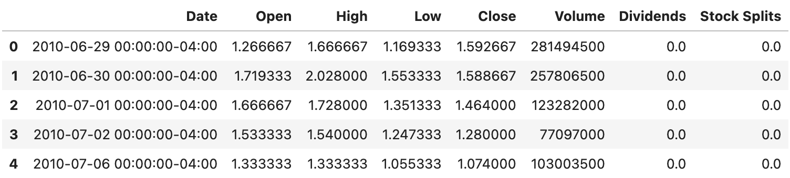
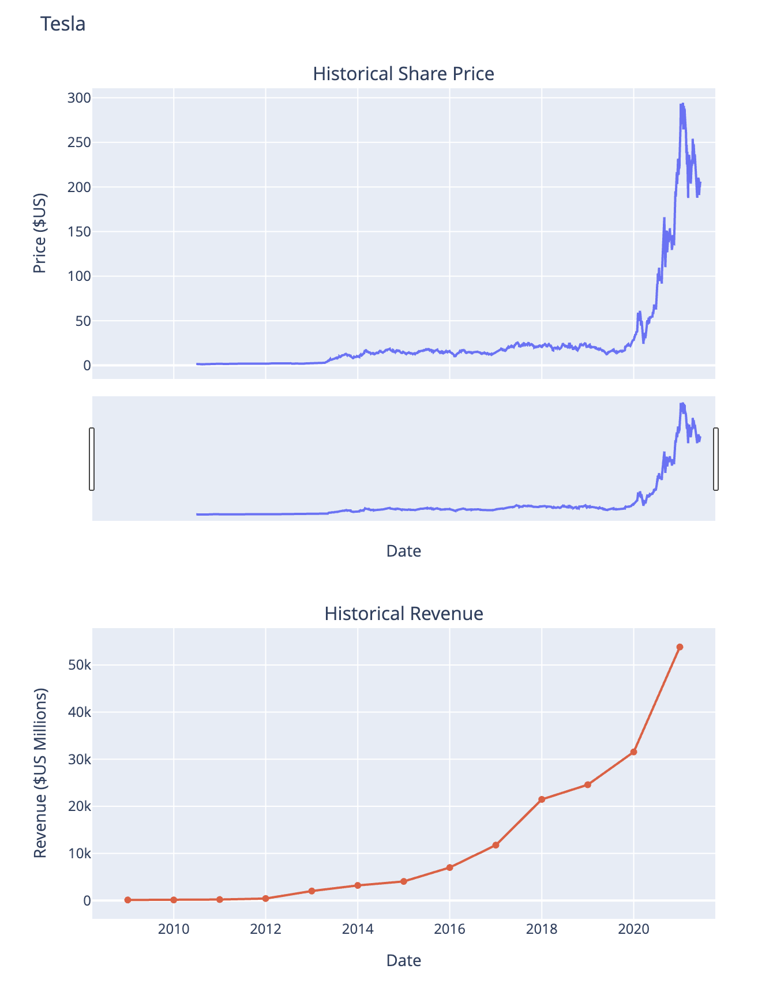

# Python Project for Data Science

Module one of *Python Project for Data Science*

## Description

This is a repository for one of Coursera’s assignments from the Course **Python Project for Data Science**. 

## Content

The key tasks of the assignment were to extract tabular data from the **yfinance-API** and given **Websites**. 
In this special case those were **stock prices** and the **company revenue** across some years from **Tesla** and **GameStop**.

### Example

Here are some example results from the Notebook. *Please note* those are *not* the submitted pictures for the assignment. 
These pictures are for illustratory purposes only.

